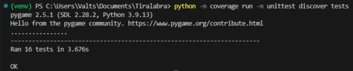
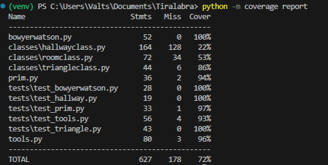
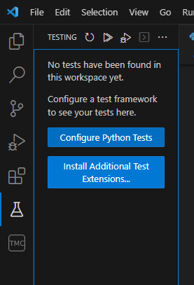
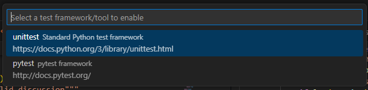
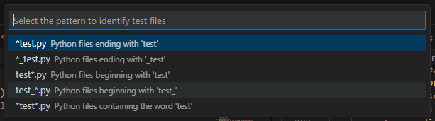
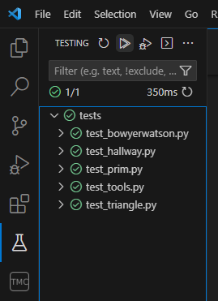

## Testing document/testausdokumentti

[Test coverage report](https://valttteri.github.io/)

I have tested my implementations of Bowyer-Watson's and Prim's algorithms and the contents of the classes directory and the tools.py file.
I made the tests and the testing report with Unittest and Coverage. All of my tests are in the directory called 'tests'. 

File test_tools.py tests the functions from file tools.py. The tests are done with a couple of
different inputs. The algorithm tests run 500 times each. They check if the algorithms return a data structure
of a valid size. These tests actually take the tools.py tests further as the algorithms use 
the functions found in that file.

#### Instructions for running the tests

1. Clone the repository and navigate to the root
```
~/ $ git clone https://github.com/valttteri/Tiralabra.git
~/ $ cd Tiralabra 
```
2. Download the required modules
```
~/Tiralabra/ $ pip install -r requirements.txt
```

3. Run the tests
```
~/Tiralabra/ $ python -m coverage run -m unittest discover tests
```


Create a report
```
~/Tiralabra/ $ python -m coverage report
```



An alternate way of doing this is by configuring VSCode's testing page. If you don't use VSCode, ignore the following.

First go to the testing page and select "Configure Python Tests".



Select unittest. After this VSCode asks you to select the directory containing the tests. Select "tests".



Select option "test_*.py"



Now you can run the tests by clicking the double triangle button.




