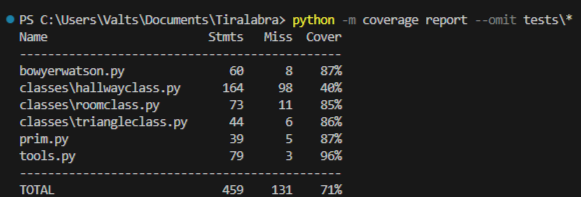

## Testing document/testausdokumentti

[Test coverage report](https://valttteri.github.io/)

I have mostly tested my implementations of Bowyer-Watson's and Prim's algorithms as they are the key components of my projects. Contents of the ``classes`` directory
and the ``tools.py`` file have also been tested to a certain level. I have tried to focus on testing functions that do calculations or create data structures. Some functions in my code are for only plotting stuff in a Pygame window and therefore I have not written tests for them. 
I made the tests and the testing report with Unittest and Coverage. All of my tests are in the ``tests`` directory. 

File ``test_tools.py`` tests the functions from file ``tools.py``. The tests are done with a couple of
different inputs. The algorithm tests mostly use randomly generated inputs and run several hundred times each.
They check if the algorithms create data structures and do calculations as they should.
These tests actually take the ``tools.py`` tests further as the algorithms use functions found in said file.

#### Instructions for running the tests

1. Clone the repository and navigate to the root
```
~/ $ git clone https://github.com/valttteri/Tiralabra.git
~/ $ cd Tiralabra 
```
2. Download the required modules
```
~/Tiralabra/ $ pip install -r requirements.txt
```

3. Run the tests
```
~/Tiralabra/ $ python -m coverage run -m unittest discover tests
```


Create a report
```
~/Tiralabra/ $ python -m coverage report --omit tests\*
```



An alternate way of doing this is by configuring VSCode's testing page.

First go to the testing page and select "Configure Python Tests".


Select unittest. After this VSCode asks you to select the directory containing the tests. Select "tests".


Select option "test_*.py"


Now you can run the tests by clicking the double triangle button.


